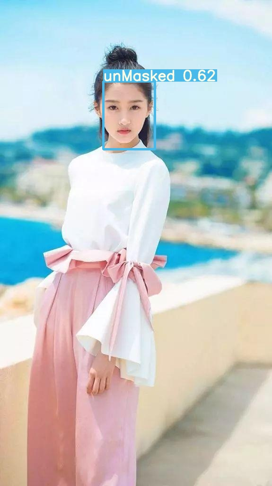
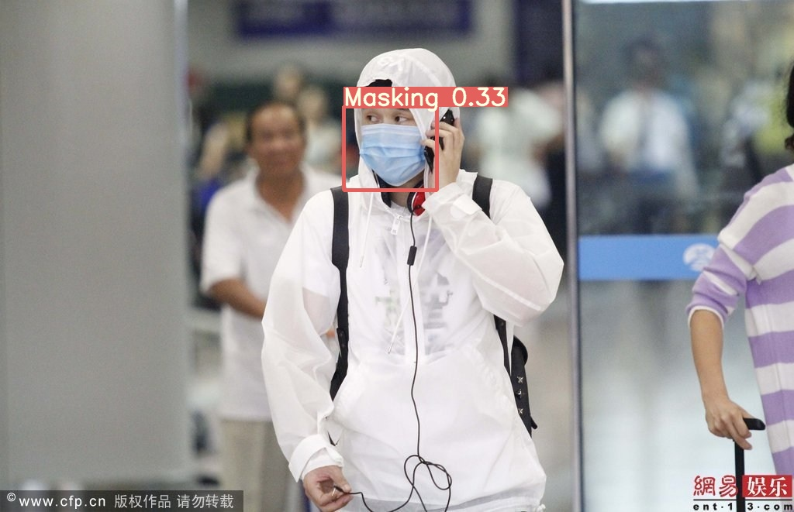
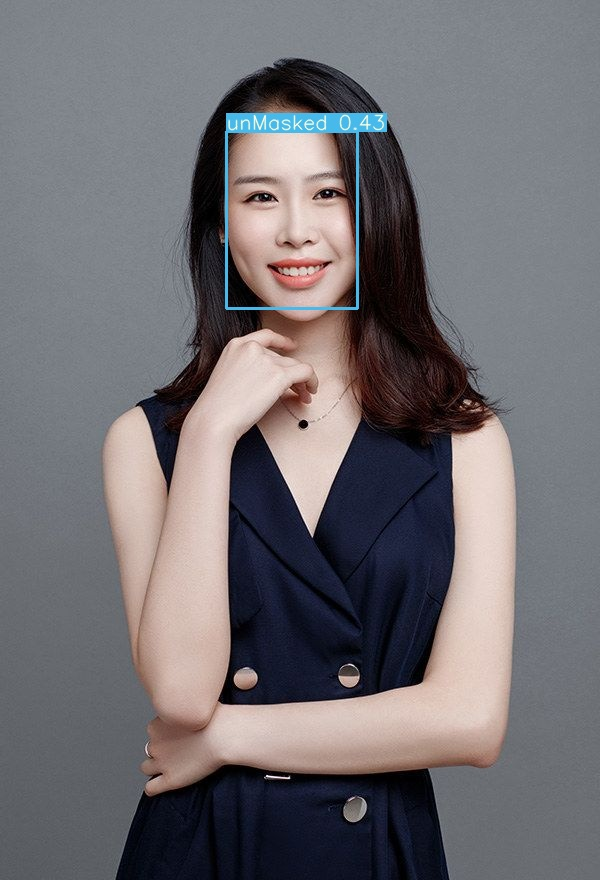
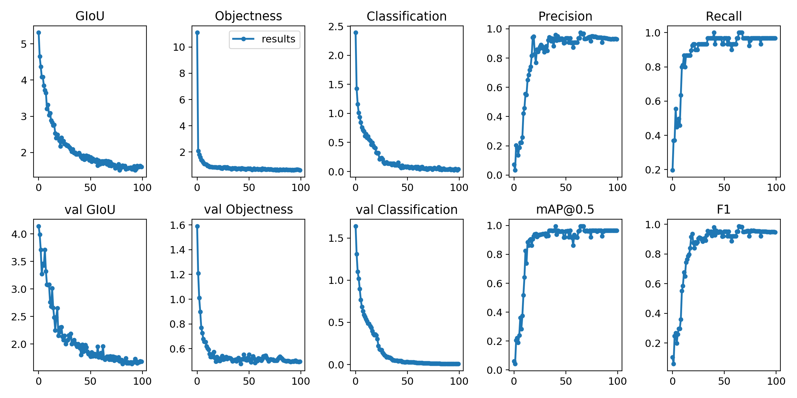
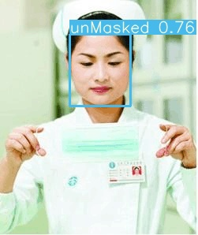
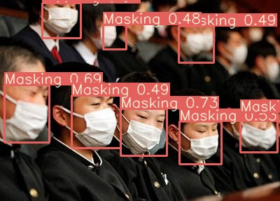
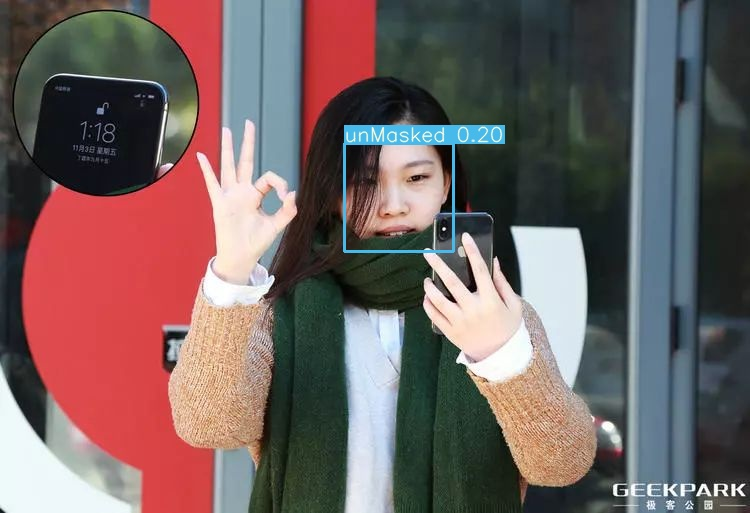
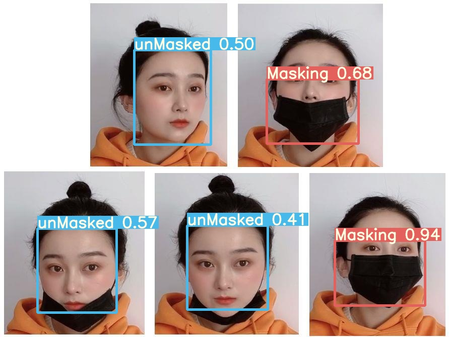
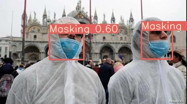
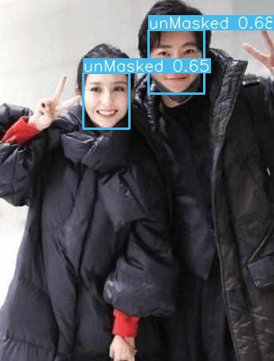

<table style="width:100%">
  <tr>
    <td>
      
    </td>
    <td align="center">
        
    </td>
    <td>
      
    </td>
  </tr>
</table>


# 人脸口罩检测与识别

该目录包含由Ultralytics LLC开发的PyTorch YOLOv3软件，并根据GPL-3.0许可可免费重新分发。有关更多信息，请访问 https://www.ultralytics.com


# 描述

该 https://github.com/ultralytics/yolov3 代码包含PyTorch YOLOv3 推理和训练代码。该代码可在Linux，MacOS和Windows上运行。默认情况下，对COCO数据集进行训练：https://cocodataset.org/#home **感谢YOLO的Joseph Redmon：** https://pjreddie.com/darknet/yolo/ 

# 要求

PPython 3.7或更高版本，pip install -U -r requirements.txt包括以下所有软件包：
- `torch >= 1.4`
- `opencv-python`
- `Pillow`
- `Nvidia Driver >= 440.44`

# 讲解

* [训练自定义数据](https://github.com/ultralytics/yolov3/wiki/Train-Custom-Data) < 强烈推荐!
* [Train Single Class](https://github.com/ultralytics/yolov3/wiki/Example:-Train-Single-Class)
* [Google Colab Notebook](https://colab.research.google.com/drive/1G8T-VFxQkjDe4idzN8F-hbIBqkkkQnxw) 具有快速培训，推断和测试示例
* [GCP 快速入门](https://github.com/ultralytics/yolov3/wiki/GCP-Quickstart)

# 训练

**开始训练:** `data/get_coco2017.sh` 请下载百度云网盘数据后开始训练 `python3.6 train.py`

**恢复训练:** `python3 train.py --resume` 恢复训练 `weights/last.pt`.

**情节训练:** `from utils import utils; utils.plot_results()`



## 图像增强

`datasets.py` 将OpenCV驱动的（https://opencv.org/）增强应用于输入图像。我们使用镶嵌数据加载器（如下图所示）来增加训练过程中的图像可变性。


## 速度

**GPU：** Nvidia RTX 2080 12G
**数据集：** (135张图像)
**型号：** yolov3-tiny.cfg
**命令：** python3.6 train.py --data data/mask_face.data --weights weights/yolov3-tiny.weights --cfg cfg/yolov3-tiny.cfg --epochs 100

GPU |n| `--batch --accum` | img/s | epoch<br>time | epoch<br>cost
--- |--- |--- |--- |--- |---
|| ||  | -<br>-

# 推理

```bash
python3.6 detect.py --names data/mask_face.names --cfg cfg/yolov3-tiny.cfg --weights weights/best.pt --source ...
```

- 图片： `--source file.jpg`
- 视频： `--source file.mp4`
- 目录： `--source dir/`
- 摄像头： `--source 0`
- RTSP流： `--source rtsp://170.93.143.139/rtplive/470011e600ef003a004ee33696235daa`
- HTTP流： `--source http://wmccpinetop.axiscam.net/mjpg/video.mjpg`

**YOLOv3:** `python3.6 detect.py --names data/mask_face.names --cfg cfg/yolov3.cfg --weights weights/best.pt`

**YOLOv3-tiny:** `python3.6 detect.py --names data/mask_face.names --cfg cfg/yolov3-tiny.cfg --weights weights/best.pt`  

**YOLOv3-SPP:** `python3.6 detect.py --names data/mask_face.names --cfg cfg/yolov3-spp.cfg --weights weights/best.pt`  


# 预训练模型

从以下位置下载： [百度网盘 密码:idra](https://pan.baidu.com/s/1xJ58AD_CQgPqflnou19JiA)

----










